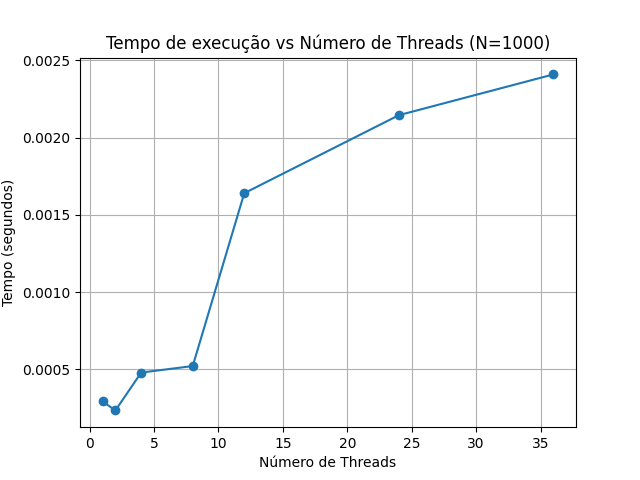
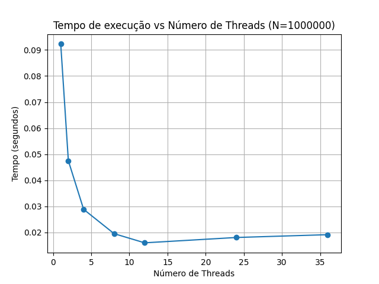
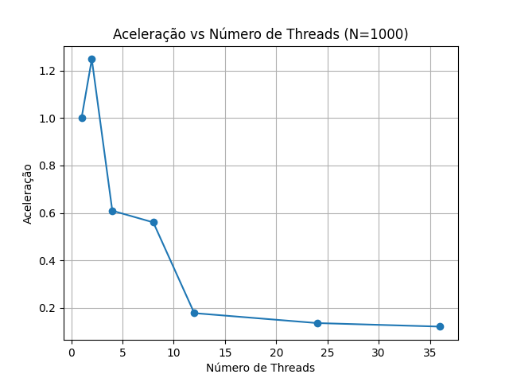
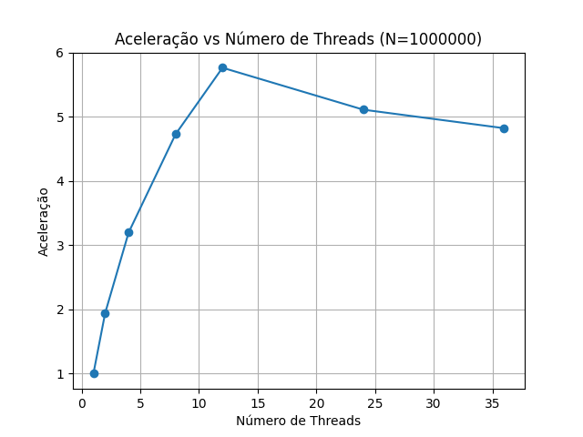
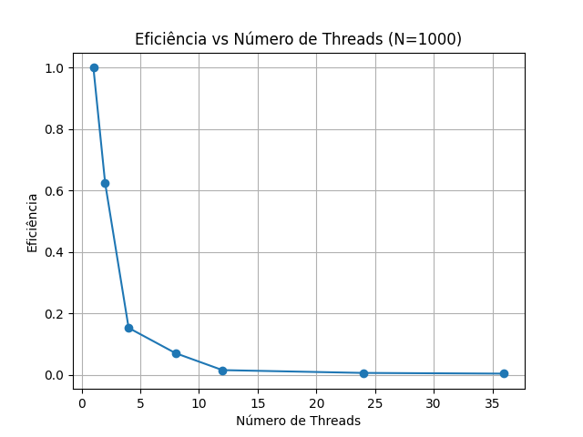
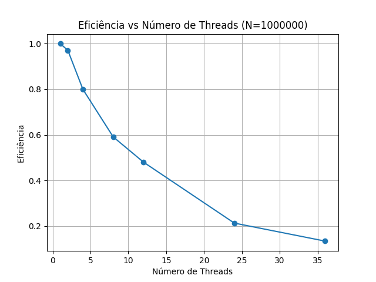

# Identificação de números primos com *threads* em C ⚙️

Esta atividade tem como objetivo mostrar, de forma prática, como usar **variáveis compartilhadas** e **controle de concorrência** via **locks** para identificar números **primos** em uma sequência de 1 até `N`, utilizando **threads** com **locks** em C.

---

## 🧪 Arquivos

### `atividade4.c`

Este programa realiza a contagem de números primos de forma concorrente.

**Funcionalidades:**
- Recebe como parâmetros de entrada: `N` (limite superior da sequência) e o número de threads a serem usadas.
- Cria um grupo de threads que dinamicamente obtém o próximo número da sequência para testar primalidade.
- Utiliza **`pthread_mutex_t`** para proteger o acesso à variável `atual` (número sendo avaliado) e ao contador global de primos `nprimos`.
- Faz a divisão do trabalho de forma **dinâmica**, conforme as threads ficam disponíveis.
    - Essa lógica otimizada é de separar por blocos (nesse caso, 100) para análise de cada thread. Cada thread pega o próximo bloco disponível para analisar até que N seja alcançado.
- Calcula o tempo de execução, a aceleração e a eficiência, salvando os resultados em arquivos `.txt`.

**Uso:**

```bash
# Para compilar (com a biblioteca de math):
gcc -o atividade4 atividade4.c -lm -lpthread
```

```bash
# Para executar:
./atividade4 <N> <numero_de_threads>

# Exemplo:
./atividade4 1000000 8
# analisar N=1_000_000 primos, com 8 threads
```

**Saída:**
- Total de primos encontrados.
- Arquivo `resultados_N{valorN}_{threads}threads.txt` com:
  - Tempo de execução (linha 1)
  - Aceleração (linha 2)
  - Eficiência (linha 3)

---

## 📈 Otimizações realizadas

Inicialmente, o programa criava **muito overhead** por:
- Cada thread pegar apenas **1 número** por vez.
- Atualizar o contador de primos `nprimos` **a cada número**.

**O que foi otimizado:**

- **Pegar blocos de números**:
  - Cada thread pega um bloco (ex: 100 números) por vez, diminuindo drasticamente o número de `locks`.

- **Usar contador local**:
  - Cada thread conta seus primos localmente e só atualiza o contador global uma única vez no final.

Essas mudanças tornaram o programa **muito mais eficiente**, aproveitando melhor o paralelismo, que estava ineficiente até para valores N maiores.

---

## 📈 Gráficos gerados

Foi usado o conjunto **Python + Matplotlib** para gerar gráficos com base nos arquivos `.txt` criados pelo programa.

Os gráficos gerados foram:
- **Tempo de execução vs Número de threads**
- **Aceleração vs Número de threads**
- **Eficiência vs Número de threads**

para dois valores de N:
- `N = 1000`
- `N = 1.000.000`

**Entrar no diretório dos gráficos:**
```bash
cd graphs
```

**Baixar lib utilizada:**
```bash
pip install -r requirements.txt
```

**Script usado:**
```bash
python gera-graphs.py
```

---

## 🧠 Análise dos gráficos

### Tempo de execução

- **N = 1000**:
  - O tempo **aumenta** com o número de threads.
  - Overhead de gestão de threads supera o tempo da tarefa.
    - com 2 threads, o paralelismo ainda compensa o pequeno overhead de criar e sincronizar as threads (baixo custo de concorrência)
    - com 5 threads, o custo de concorrência já se tornou maior que o ganho, pelo menos para o número baixo de N

  

- **N = 1.000.000**:
  - O tempo **cai** até 12 threads.
  - Depois de 12 threads (limite de CPUs), o tempo **para de melhorar** e **aumenta** levemente.

  

### Aceleração

- **N = 1000**:
  - Pequeno ganho inicial, mas aceleração despenca conforme aumenta as threads.

  

- **N = 1.000.000**:
  - Aceleração quase linear até 12 threads.
  - Depois disso, cai por overhead de troca de contexto.

  

### Eficiência

- **N = 1000**:
  - Eficiência cai quase a zero com mais de 4 threads.
  - Pouco trabalho para muitas threads.

  

- **N = 1.000.000**:
  - Eficiência se mantém boa até 8 threads.
  - Depois cai suavemente conforme aumentam as threads.

  

---

## 🏁 Conclusões

- Para problemas **pequenos (N=1000)**:
  - Melhor usar 1 ou 2 threads.
  - O overhead de concorrência destrói o ganho de paralelismo.

- Para problemas **grandes (N=1.000.000)**:
  - Ganho real de paralelismo até o limite físico da máquina (12 CPUs).
  - Excelente eficiência com até 8-12 threads.

- Comportamento ao exceder o número de CPUs:
  - A máquina utilizada tem limite físico de **12 CPUs disponíveis**. Um comportamento interessante foi observado ao **analisar o aumento do número de threads acima do limite físico de CPUs disponíveis**:
    - Para N=1000, a performance melhorou levemente ao ultrapassar o número de CPUs lógicas da máquina.
    - Já para N=1.000.000, a performance piorou.
    - Explicação:
      - Em N=1000, como o problema é muito pequeno, as threads não ficam longamente presas competindo pelos locks e não ocupam a CPU por muito tempo. Assim, quando o número de threads ultrapassa o número de CPUs, o sistema operacional naturalmente espaça as execuções (via escalonamento preemptivo), reduzindo levemente a contenção sobre o mutex. Isso gera uma melhora suave no tempo de execução.

      - Em N=1.000.000, como o trabalho é grande e cada thread precisa da CPU por bastante tempo para processar blocos grandes de números, ao ultrapassar o limite de CPUs, ocorre grande disputa por CPU, aumento de troca de contexto e atrasos, piorando a performance geral.

- A aplicação de **blocos dinâmicos** e **contadores locais** foi essencial para evitar que o tempo de disputa por locks matasse o desempenho.

- O comportamento observado nos testes é consistente com a **Lei de Amdahl**, onde o speedup é limitado pela parte do programa que não pode ser paralelizada.

- É necessário ajustar a estratégia de paralelização ao tamanho do problema e ao hardware disponível.
  - Utilizar o número de threads apropriado ao valor de N e ao limite físico de CPUs da máquina.
  - Para esse algoritmo específico, ajustar o valor da variável da função executada pelas threads `tamanho_bloco` para valores adequados ao tamanho de N.

